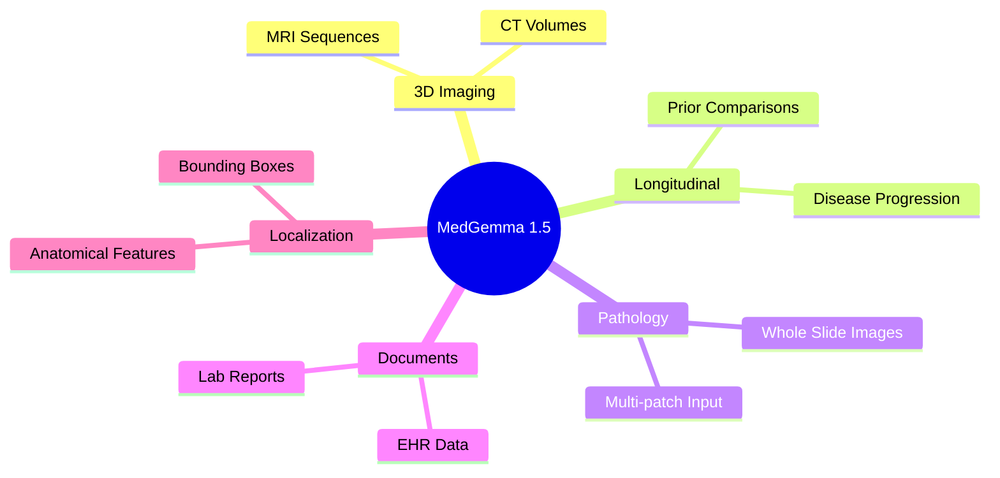
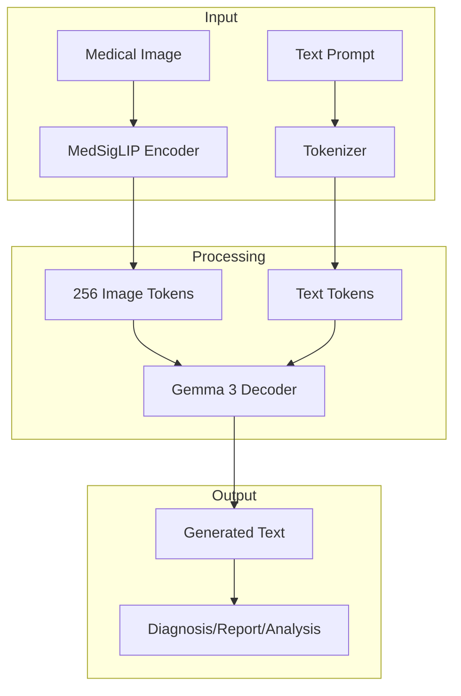
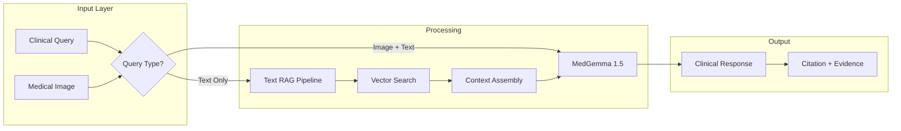
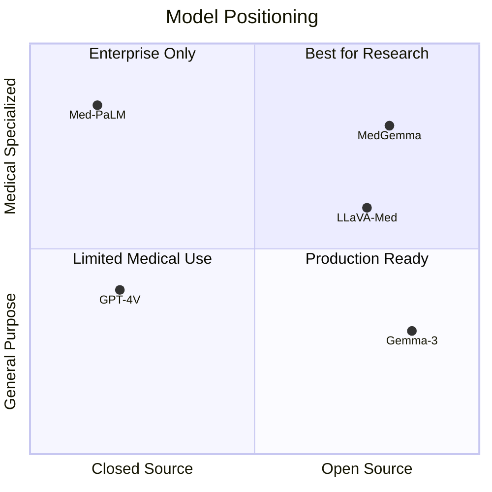

Google just dropped MedGemma 1.5, and it's a significant upgrade for anyone building clinical AI systems. As someone who's spent the last two years building production medical AI at Mount Sinai, I want to break down what's actually new and why it matters.

## What's New in 1.5

MedGemma 1.5 isn't just an incremental update. It adds entirely new capabilities:



## Architecture Overview

MedGemma builds on Gemma 3's decoder-only transformer with a specialized medical image encoder:



### Key Specs

| Specification | Value |
|--------------|-------|
| Parameters | 4B |
| Context Length | 128K tokens |
| Image Resolution | 896 x 896 |
| Image Tokens | 256 per image |
| Output Length | 8192 tokens |
| Architecture | Decoder-only Transformer |
| Attention | Grouped-Query Attention (GQA) |

## Performance Deep Dive

### Medical Text Reasoning

The text-only benchmarks show solid improvements over the previous version:

```echarts
{
  "title": {
    "text": "Medical QA Benchmarks",
    "left": "center"
  },
  "tooltip": {
    "trigger": "axis"
  },
  "legend": {
    "data": ["Gemma 3 4B", "MedGemma 1 4B", "MedGemma 1.5 4B"],
    "top": "10%"
  },
  "xAxis": {
    "type": "category",
    "data": ["MedQA", "MedMCQA", "PubMedQA", "MMLU Med"]
  },
  "yAxis": {
    "type": "value",
    "min": 40,
    "max": 80
  },
  "series": [
    {
      "name": "Gemma 3 4B",
      "type": "bar",
      "data": [50.7, 45.4, 68.4, 67.2]
    },
    {
      "name": "MedGemma 1 4B",
      "type": "bar",
      "data": [64.4, 55.7, 73.4, 70.0]
    },
    {
      "name": "MedGemma 1.5 4B",
      "type": "bar",
      "data": [69.1, 59.8, 68.2, 69.6]
    }
  ]
}
```

### Imaging Performance

The real story is in the imaging benchmarks. MedGemma 1.5 shows dramatic improvements in 3D imaging and whole-slide pathology:

| Task | Gemma 3 4B | MedGemma 1 4B | MedGemma 1.5 4B |
|------|-----------|---------------|-----------------|
| CT Classification (7 conditions) | 54.5% | 58.2% | **61.1%** |
| MRI Classification (10 conditions) | 51.1% | 51.3% | **64.7%** |
| WSI Pathology (ROUGE) | 2.3 | 2.2 | **49.4** |
| EyePACS Fundus | 14.4% | 64.9% | **76.8%** |
| Longitudinal CXR | 59.0% | 61.1% | **65.7%** |

The jump from 2.2 to 49.4 ROUGE on whole-slide pathology is remarkable.

## Quick Start Code

Here's how to get started with the pipeline API:

```python
from transformers import pipeline
from PIL import Image
import requests
import torch

# Initialize the pipeline
pipe = pipeline(
    "image-text-to-text",
    model="google/medgemma-1.5-4b-it",
    torch_dtype=torch.bfloat16,
    device="cuda",
)

# Load a chest X-ray
image_url = "https://upload.wikimedia.org/wikipedia/commons/c/c8/Chest_Xray_PA_3-8-2010.png"
image = Image.open(
    requests.get(image_url, headers={"User-Agent": "example"}, stream=True).raw
)

# Create the prompt
messages = [
    {
        "role": "user",
        "content": [
            {"type": "image", "image": image},
            {"type": "text", "text": "Describe this X-ray"}
        ]
    }
]

# Generate
output = pipe(text=messages, max_new_tokens=2000)
print(output[0]["generated_text"][-1]["content"])
```

Or using the model directly for more control:

```python
from transformers import AutoProcessor, AutoModelForImageTextToText
import torch

model_id = "google/medgemma-1.5-4b-it"

model = AutoModelForImageTextToText.from_pretrained(
    model_id,
    torch_dtype=torch.bfloat16,
    device_map="auto",
)
processor = AutoProcessor.from_pretrained(model_id)

# Process inputs
inputs = processor.apply_chat_template(
    messages,
    add_generation_prompt=True,
    tokenize=True,
    return_dict=True,
    return_tensors="pt"
).to(model.device, dtype=torch.bfloat16)

# Generate with control over parameters
with torch.inference_mode():
    generation = model.generate(
        **inputs,
        max_new_tokens=2000,
        do_sample=False
    )
```

## Integration Architecture

Here's how I'm thinking about integrating MedGemma into a clinical RAG system:



## What This Means for Clinical AI

### The Good

1. **Open weights** - Unlike GPT-4V or Med-PaLM, you can actually run this locally
2. **4B parameters** - Fits on a single GPU, practical for production
3. **3D imaging support** - CT/MRI interpretation was a major gap
4. **EHR understanding** - Finally, a model that can parse clinical notes

### The Limitations

> **Important**: MedGemma is not intended for direct clinical use. All outputs require independent verification.

- Single-image evaluation only (no multi-image comparison in benchmarks)
- Not optimized for multi-turn conversations
- Prompt-sensitive (more than base Gemma)
- English-only evaluation

## Comparison with Alternatives



## Next Steps

I'm planning to:

1. **Benchmark against our RAG system** - How does MedGemma compare to Mistral-7B for clinical QA?
2. **Test 3D imaging** - We have CT data from the MMAP pipeline
3. **Fine-tune for hematology** - Our OncoCITE system could benefit from better image understanding

## Resources

- [Model on Hugging Face](https://huggingface.co/google/medgemma-1.5-4b-it)
- [Technical Report](https://arxiv.org/abs/2507.05201)
- [Tutorial Notebooks](https://github.com/Google-Health/medgemma)

---

*What are you building with MedGemma? I'd love to hear about your use cases in the comments below.*
